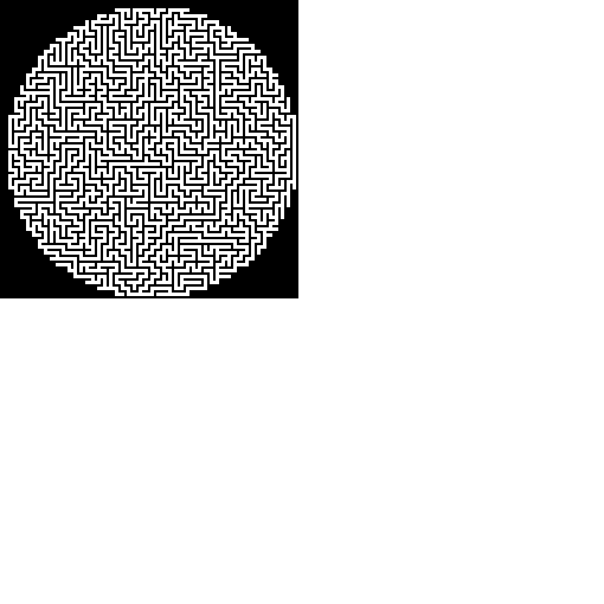

# Maze generator with P5

Maze generator algorithms with visualization using p5js.

The implemented algorithms are:

* Depth-first search
* Prim
* Kruskal

`sketch_circle.js` is an example of a maze generation with DFS using a rule to form a circle, `sketch_circle_iteration.js` is the equivalent example with per-iteration visualization.

## Credits

* [p5js](https://p5js.org/)
* The [maze generator algorithm](https://en.wikipedia.org/wiki/Maze_generation_algorithm) wikipedia page
