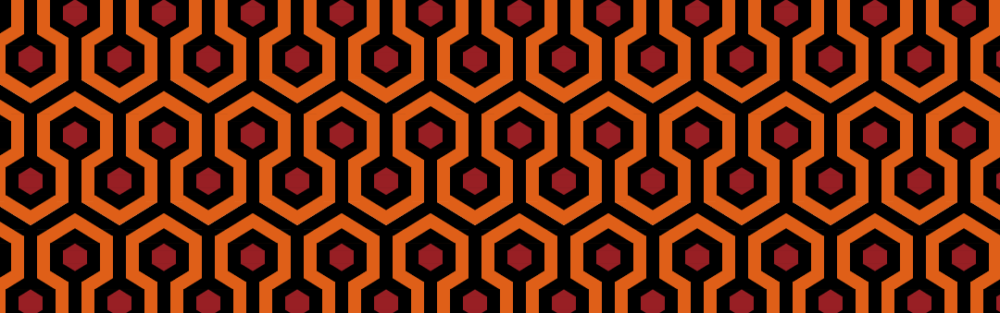
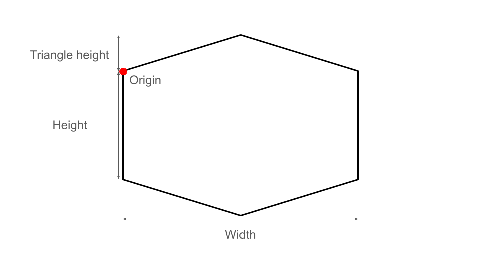
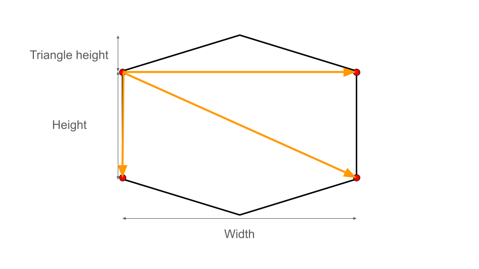
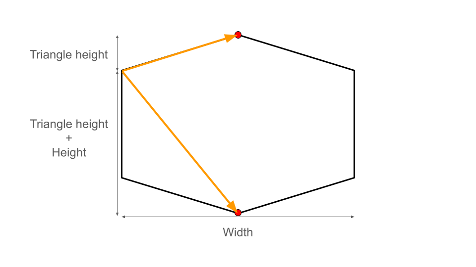
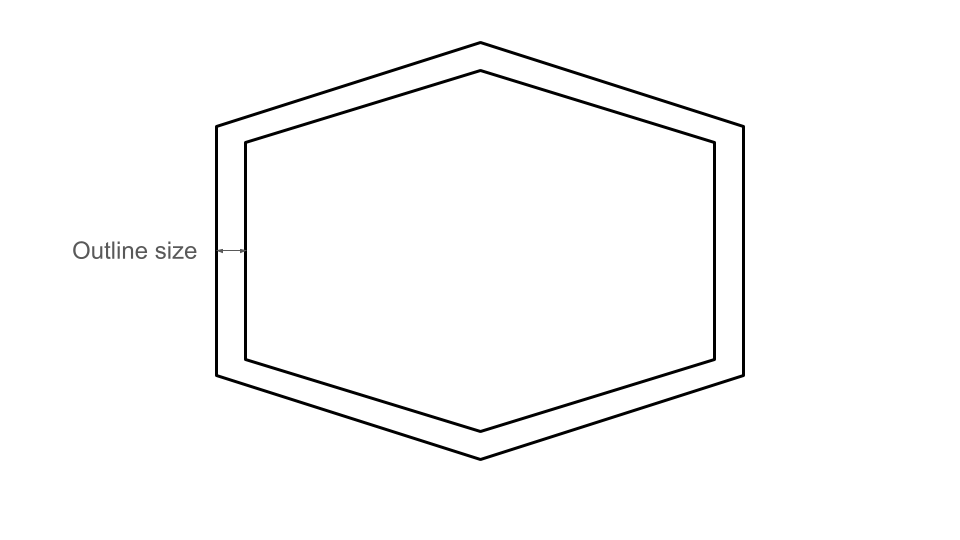
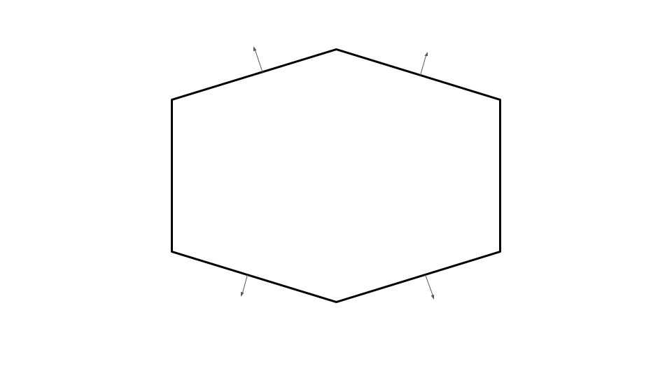
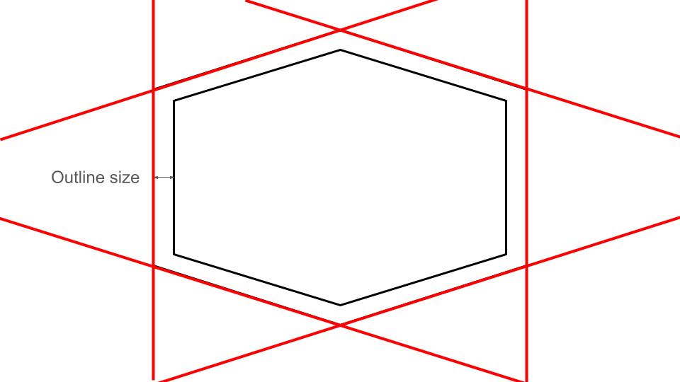
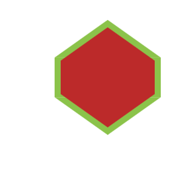

The Hicks' Hexagon is a pattern created by [David Hicks](https://en.wikipedia.org/wiki/David_Hicks_(designer)) in the 1960s. It got popular in the Stanley Kubrick's movie [The Shining](https://en.wikipedia.org/wiki/The_Shining_(film)).

Thanks to [p5js](https://p5js.org/) I implemented a generalization of this pattern.

## Drawing an hexagon

First we need to create an hexagon class. In my code I chose to define an hexagon by four metrics: its origin, its width, its height and the height of its up and down triangles.



```js
class Hexagon {
    constructor(origin, width, height, triangle_height) {
        this.origin = origin;
        this.width = width;
        this.height = height;
        this.triangle_height = triangle_height;
    }
}
```

Because of the way the p5js API works, we need to explicitly pass the 3 points of a triangle if we want to draw it. So we need to translate our four metrics system into two set of three points.
The points of the main rectangle are easy to get, we just add the width and/or the height to get them.



```js
// this.origin corresponds to the upper left vertex of the main rectangle
this.down_right = p5.Vector.add(this.origin, createVector(this.width, this.height));
this.down_left = p5.Vector.add(this.origin, createVector(0, this.height));
this.up_right = p5.Vector.add(this.origin, createVector(this.width, 0));
```

Then to compute the position of the tops of our triangles we only need to add the right vector to the origin. See the following graph:



```js
this.up = p5.Vector.add(
	this.origin,
	createVector(this.width / 2, -this.triangle_height)
);
this.down = p5.Vector.add(
	this.origin,
	createVector(this.width / 2, this.height + this.triangle_height)
);
```

We can now draw a hexagon thanks to the following method:

```js
fill(color, image) {
    image.noStroke()
    image.fill(color);

	// Draw the main rectangle
    image.rect(this.origin.x, this.origin.y, this.width, this.height);

	// Draw the triangle
    image.triangle(
        this.origin.x,
        this.origin.y,

        this.up_right.x,
        this.up_right.y,

        this.up.x,
        this.up.y
    );
    image.triangle(
        this.down_left.x,
        this.down_left.y,

        this.down_right.x,
        this.down_right.y,

        this.down.x,
        this.down.y
    );
}
```

We obtain the following hexagon:


You can find the code for the hexagon drawing here: [https://editor.p5js.org/charlyalizadeh/sketches/okWoy5P_Q](https://editor.p5js.org/charlyalizadeh/sketches/okWoy5P_Q)

## Drawing the outlines of an hexagon

Now that we can draw an hexagon we need a way to know where to draw its outline. We define the outline of an hexagon based on the distance between the edges.




We define four methods, one for each non vertical edge, that return the norm unit vector of the corresponding edge.



```js
 norm_vector_up_left() {
     let norm_vector = p5.Vector.sub(this.up, this.origin);
     norm_vector.x += norm_vector.y;
     norm_vector.y = norm_vector.x - norm_vector.y;
     norm_vector.x -= norm_vector.y;
     norm_vector.y = -norm_vector.y;
     norm_vector.normalize();
     return norm_vector;
 }
 norm_vector_up_right() {
     let norm_vector = this.norm_vector_up_left();
     norm_vector.x = -norm_vector.x;
     return norm_vector;
 }
 norm_vector_down_right() {
     return this.norm_vector_up_left().mult(-1);
 }
 norm_vector_down_left() {
     let norm_vector = this.norm_vector_up_left();
     norm_vector.y = -norm_vector.y;
     return norm_vector;
 }
```


 We're gonna use those methods to get the `Line` objects corresponding to the lines on which the outline edges should be drawn.
 We don't implement the norm methods for the vertical edges because we can just shift the x coordinate of the edge to get the desired outline.




To get the outline we just build the norm unit vector for each edge, multiply it by the desired size and then add it to the corresponding of the end of the edges.

```js
 outline_line_up_left(outline_size) {
     let offset_vector = this.norm_vector_up_left().mult(outline_size);
     let p1 = p5.Vector.add(this.up, offset_vector);
     let p2 = p5.Vector.add(this.origin, offset_vector);
     return new Line(p1, p2);
 }
 outline_line_up_right(outline_size) {
     let offset_vector = this.norm_vector_up_right().mult(outline_size);
     let p1 = p5.Vector.add(this.up, offset_vector);
     let p2 = p5.Vector.add(this.up_right, offset_vector);
     return new Line(p1, p2);
 }
 outline_line_left(outline_size) {
     let p1 = this.origin.copy();
     p1.x -= outline_size;
     let p2 = this.down_left.copy();
     p2.x -= outline_size;
     return new Line(p1, p2)
 }
 outline_line_right(outline_size) {
     let p1 = this.up_right.copy();
     p1.x += outline_size;
     let p2 = this.down_right.copy();
     p2.x += outline_size;
     return new Line(p1, p2)
 }
 outline_line_down_left(outline_size) {
     let offset_vector = this.norm_vector_down_left().mult(outline_size);
     let p1 = p5.Vector.add(this.down_left, offset_vector);
     let p2 = p5.Vector.add(this.down, offset_vector);
     return new Line(p1, p2);
 }
 outline_line_down_right(outline_size) {
     let offset_vector = this.norm_vector_down_right().mult(outline_size);
     let p1 = p5.Vector.add(this.down_right, offset_vector);
     let p2 = p5.Vector.add(this.down, offset_vector);
     return new Line(p1, p2);
 }
```

Now that we have our outline lines we can build our new `Hexagon` object.

```js
 outline_edge(outline_size) {
	 // Get the outline lines
     let line_up_left = this.outline_line_up_left(outline_size);
     let line_up_right = this.outline_line_up_right(outline_size);
     let line_left = this.outline_line_left(outline_size);
     let line_right = this.outline_line_right(outline_size);
     let line_down_left = this.outline_line_down_left(outline_size);
     let line_down_right = this.outline_line_down_right(outline_size);

	 // The new origin is the intersection between the upper left and left lines
     let new_origin = line_intersection(
         line_up_left.p1, line_up_left.p2,
         line_left.p1, line_left.p2
     );

	 // We compute the upper right corner of the new rectangle to compute the width
     let new_up_right = line_intersection(
         line_up_right.p1, line_up_right.p2,
         line_right.p1, line_right.p2
     )
     let new_width = new_up_right.x - new_origin.x;

	 // We compute the bottom left corner of the new rectangle to compute the height
     let new_down_left = line_intersection(
         line_down_left.p1, line_down_left.p2,
         line_left.p1, line_left.p2
     )
     let new_height = new_down_left.y - new_origin.y;

	 // Finally we compute the new up to get the new triangle height
     let new_up = line_intersection(
         line_up_right.p1, line_up_right.p2,
         line_up_left.p1, line_up_left.p2
     )
     let new_triangle_height = new_origin.y - new_up.y;
     return new Hexagon(new_origin, new_width, new_height, new_triangle_height);
 }
```

We obtain the following result:



Link to the p5 code for the outline: https://editor.p5js.org/charlyalizadeh/sketches/x9yaRcvTY


## Drawing the pattern

Drawing the hexagon was the easy part. Explaining how the pattern is drawn would take a long time. I will try do it as soon as I can but for the moment I don't have the time to do it.
